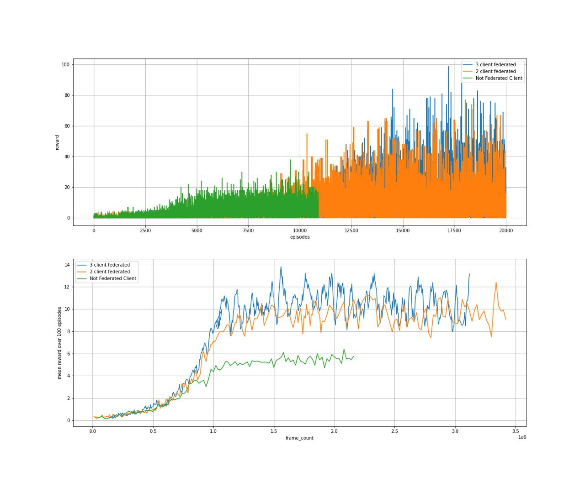

# Federated Learning

This repo represents a new technique based on Federated Learning for training Deep Q Reinforcement Learning models. 

## Results
In this repo, three DeepQRL models have been trained independently on the frames of the Atari Breakout game. After seeing 10000 frames, every model sends its weights to the server. Then the server will combine these weights (there are different techniques for combining these weights such as combining models by their scores, averaging their weights, etc.), and sends the updated weights to each model. 

The results are as follows:

As is evident in the results, 3 client training by using Federated Learning has achieved a better performance than two and one-client training. 
